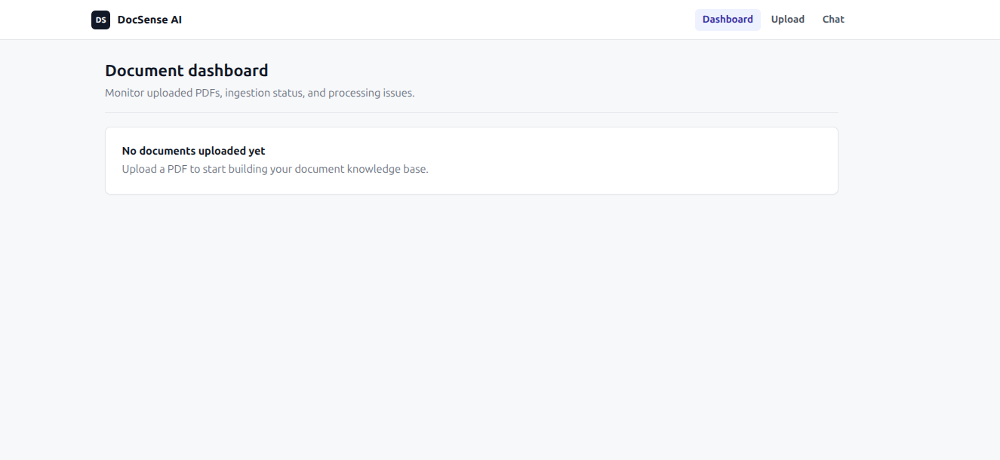
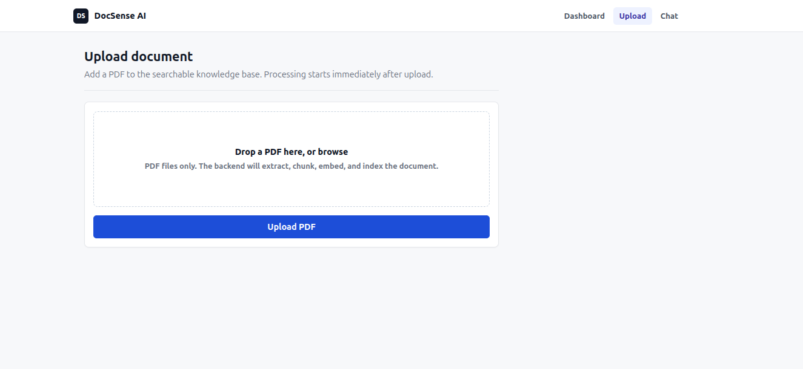
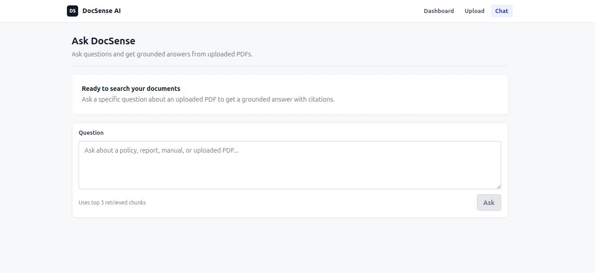

# DocSense AI

A production-style Retrieval Augmented Generation (RAG) document intelligence platform that allows users to upload PDF documents, perform semantic search over their contents, and generate AI-powered answers grounded with source citations.

The system combines modern AI application architecture with production backend engineering practices:

* Document ingestion pipelines
* Vector similarity search
* Local LLM inference
* REST API architecture
* React frontend
* Containerized deployment
* Service-to-service communication

The goal of this project is to explore how real-world AI-powered document systems are designed, including ingestion workflows, retrieval systems, API architecture, frontend integration, and reliable deployment patterns.

---

# Why I Built This

Modern teams store large amounts of information inside documents such as technical documentation, research papers, internal guides, and product manuals.

Traditional document search relies heavily on keyword matching, which makes it difficult to find relevant information when users do not know the exact wording used inside a document.

I built DocSense AI to explore how modern AI-powered knowledge systems solve this problem using Retrieval Augmented Generation (RAG).

The project focuses on building a complete document intelligence workflow:

* Ingesting unstructured documents
* Converting text into semantic vector representations
* Performing similarity-based retrieval
* Generating grounded AI responses
* Providing citations so users can verify answers

Beyond the AI component, this project explores production application engineering:

* Designing maintainable backend APIs
* Separating business logic into services
* Building a complete React application
* Running AI models locally
* Containerizing services using Docker
* Creating reproducible environments

---

# Features

## Document Intelligence Pipeline

* Upload PDF documents through a web interface or API
* Extract text from documents
* Split documents into optimized chunks
* Generate semantic embeddings
* Store vectors for similarity search
* Retrieve relevant document context
* Track document processing status

Pipeline:

```
PDF Upload

     |
     v

Text Extraction

     |
     v

Chunking

     |
     v

Embedding Generation

     |
     v

Vector Storage

     |
     v

Semantic Retrieval

     |
     v

LLM Answer Generation
```

---

## AI Question Answering

Users can ask natural language questions about uploaded documents.

The system:

1. Converts the question into an embedding
2. Performs similarity search
3. Retrieves relevant document chunks
4. Sends retrieved context to the LLM
5. Generates an answer with citations

Responses include:

* Document name
* Page number
* Retrieved text
* Similarity score

---

# System Architecture

```
                         User

                          |

                          v

                  React Frontend

                          |

                          v

                    Nginx Proxy

                          |

                          v

                  FastAPI Backend

        ----------------------------------

        |                |                |

        v                v                v

     SQLite          ChromaDB          Ollama

   Metadata          Vectors            LLM


                          |

                          v

              Document Processing Pipeline
```

---

# Technical Stack

## Frontend

* React
* JavaScript
* Axios
* REST API integration
* Component-based UI
* Vite production build
* Nginx static serving

## Backend

* Python
* FastAPI
* Pydantic
* SQLite
* Service-layer architecture

## AI / Search

* Sentence Transformers embeddings
* ChromaDB vector database
* Ollama local LLM inference

## Infrastructure

* Docker
* Docker Compose
* Nginx reverse proxy

## Testing

* Pytest
* Mocked AI/vector dependencies

---

# Frontend Application

The frontend provides a complete user interface for interacting with the RAG system.

## Dashboard

Users can:

* View uploaded documents
* Monitor processing status
* See ingestion failures
* Track document availability

---

## Document Upload

The upload interface supports:

* PDF selection
* Upload validation
* Document ingestion workflow
* Processing status updates

---

## AI Chat Interface

Users can query documents through a conversational interface.

Workflow:

```
User Question

      |

React Request

      |

FastAPI Retrieval Pipeline

      |

Relevant Chunks

      |

LLM Generation

      |

Answer + Citations
```

---

# How RAG Works

Traditional search matches keywords.

RAG performs semantic search.

Example:

```
"What are actuators used for?"
```

The system:

1. Converts the question into a vector
2. Compares it against document embeddings
3. Retrieves the closest document chunks
4. Provides those chunks as context to the LLM
5. Generates a grounded response

This reduces hallucination by ensuring answers are based on retrieved document evidence.

---

# Project Structure

```
docsense-ai/

├── frontend/
│
│   ├── src/
│   ├── Dockerfile
│   └── nginx.conf
│
├── backend/
│
│   ├── app/
│   ├── api/
│   ├── services/
│   ├── core/
│   ├── tests/
│   └── Dockerfile
│
└── docker-compose.yml
```

---

# Setup

## Prerequisites

Install:

* Docker
* Docker Compose
* Ollama

Verify:

```bash
docker --version

docker compose version

ollama --version
```

---

# Environment Configuration

## Backend Environment

Create:

```
backend/.env
```

Example:

```env
DOCSENSE_OLLAMA_BASE_URL=http://host.docker.internal:11434
DOCSENSE_OLLAMA_MODEL=llama3.2:3b
DOCSENSE_OLLAMA_TIMEOUT_SECONDS=120

DOCSENSE_CHUNK_SIZE=500
DOCSENSE_CHUNK_OVERLAP=100
DOCSENSE_MIN_CHUNK_CHARS=80
DOCSENSE_MIN_RETRIEVAL_SCORE=0.2
```

These variables configure:

* Local LLM connection
* Retrieval parameters
* Document processing behavior

---

## Frontend Environment

Create:

```
frontend/.env
```

Example:

```env
VITE_API_URL=/api
```

The frontend communicates with the backend through Nginx reverse proxy routing.

Requests:

```
Browser

/api/v1/documents

        |

        v

Nginx

        |

        v

FastAPI Backend
```

This avoids hardcoding backend container addresses inside the frontend.

---

# Running the Application

Build and start all services:

```bash
docker compose up --build
```

Docker will:

1. Build the React frontend
2. Build the FastAPI backend
3. Install required dependencies
4. Start Nginx
5. Start the backend API
6. Connect services through Docker networking

Application:

Frontend:

```
http://localhost:5173
```

Backend:

```
http://localhost:8000
```

API Documentation:

FastAPI provides interactive documentation:

```
http://localhost:8000/docs
```

---

# Running Ollama

Pull the model:

```bash
ollama pull llama3.2:3b
```

Start Ollama:

```bash
ollama serve
```

The backend container communicates with Ollama through:

```
host.docker.internal:11434
```

---

# Optional Local Development Setup

For frontend/backend development without Docker:

## Backend

```bash
cd backend

python3 -m venv .venv

source .venv/bin/activate

pip install -r requirements.txt
```

Run:

```bash
uvicorn app.main:app --reload
```

---

## Frontend

```bash
cd frontend

npm install

npm run dev
```

This workflow is only for active development. The recommended way to run the complete application is Docker Compose.

---


# Testing

Run:

```bash
cd backend

pytest -v
```

Tests cover:

* Chunking
* Retrieval
* API behavior
* Error handling

---

# Engineering Decisions

## Why ChromaDB?

Enables semantic search instead of keyword matching.

## Why Ollama?

Provides local AI inference without external API costs.

## Why Docker?

Provides:

* Reproducible environments
* Consistent setup
* Production-style deployment

## Why Separate SQLite and ChromaDB?

SQLite:

* Application metadata

ChromaDB:

* Vector embeddings

---

# Screenshots / Demo

Screenshots will be added here.

## Dashboard



## Document Upload

*

## AI Chat



---

# Future Improvements

* Hybrid keyword + semantic search
* Reranking models
* Streaming responses
* Authentication
* Multi-user document isolation
* Cloud deployment
* Monitoring
* Kubernetes deployment
